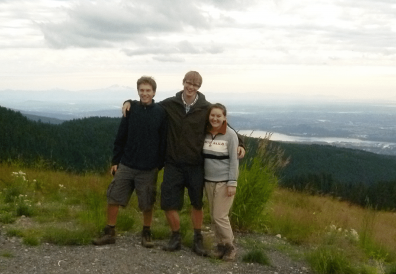

Right after highschool I spent a year in Canada to live and work and live with people with special needs. The place I stayed is called [Cascadia Society for Social Working](https://www.cascadiasociety.org/) and is placed in North Vancouver.

I wrote three reports during my stay, which are linked below. *(German)*