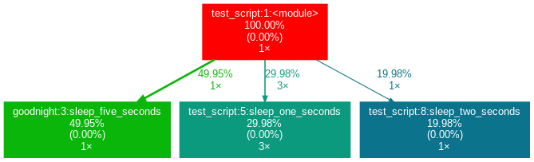
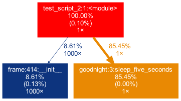
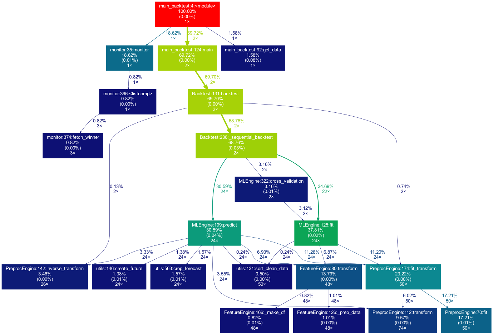

The more complex any given data science project in Python gets, the harder it naturally becomes to keep track of how all modules interact with each other. And certainly, when working in a team on a bigger project, the code base can sooner than you think grow to an extent where the complexity may seem daunting: In a typical scenario, each team member works in his or her "corner" of the project, leaving each one merely with firm *local* knowledge of the project's code but possibly only a vague idea of the overall project architecture. Ideally, however, everyone involved in the project should have a good *global*  overview of the project. By that I don't mean that one has to know how each function works internally but rather to know the responsibility of the main modules and how they are interconnected. 

A visual helper for learning about the global structure can be a call graph. A call graph is a directed graph that displays which function calls which. It is created from the data of a Python profiler such as *cProfile*. Since such a graph proved to be helpful in a project I'm working on, I created a little package called [**project_graph**](https://github.com/fior-di-latte/project_graph) which builds such a call graph for any provided python script. The package creates a profile of the given script via [*cProfile*](https://docs.python.org/3/library/profile.html) , converts it into a filtered dot graph via [*gprof2dot*](https://github.com/jrfonseca/gprof2dot) and finally exports as a .png file.

As a small first example, consider this simple module.

```python
# test_script.py

import time
from tests.goodnight import sleep_five_seconds

def sleep_one_seconds():
    time.sleep(1)

def sleep_two_seconds():
    time.sleep(2)

for i in range(3):
    sleep_one_seconds()

sleep_two_seconds()

sleep_five_seconds()
```

After installation (see below!), by writing `project_graph test_script.py` into the command line, the following png-file is placed next to the script:



The script to be profiled always acts as a starting point and is the root of the tree. Each box is captioned with a function's name, along with the overall percentage of time spent in the function as well as its number of calls. The number in brackets represents the time spent in the function's code, *excluding* time spent in other functions that are called in it. In this case, basically all time is spent in the external module `time`'s function `sleep`, which is why the number is 0.00%. In fact, rarely lots of time is spent in self-written functions, as the workload of a script usually quickly trickles down to very low-level functions of the Python implementation itself.  Also, next to the arrows is the amount of time that the one function passes to the other, along with the number of calls.  The colors (RED-GREEN-BLUE, descending) as well as the thickness of the arrows indicate the relevance of different spots in the program.

Note that the percentages of the three functions above don't add up to 100%. The reason behind is is that the graph is *set up to only include self-written functions.*  In this case, the importing the `time` module caused the Python interpreter to spend 0.04% time in a function of the module `importlib`.

Consider a second example:

```python
# test_script_2.py

import pandas as pd
from tests.goodnight import sleep_five_seconds

# some random madness
for i in range(1000):
   a_frame = pd.DataFrame([[1,2,3]])

sleep_five_seconds()
```

In this script some work is done in an external package which is called on the *top-level* and not *in* a custom function. In order to capture this in the graph, we can add the external package (`pandas`)  with the `-x` flag. However, initializing a Pandas DataFrame is done within many pandas-internal functions. Frankly, I am personally not interested in the inner convolutions of `pandas`  which is why I want the tree to not "sprout" too deep into the pandas mechanics. This can be accounted for by allowing only functions to show up if a minimal percentage of runtime is spent in them. Exactly this can be done by means of the `-m` flag. In combination, `project_graph -m 8 -x pandas test_script_2.py` yields the following:




Toy examples aside, let's move on to something more serious. A real-life data-science project could look like this one:



This time the tree is much bigger. In fact, it is actually even bigger as  there are many more self-written functions that are invoked. However, they are trimmed from the tree for clarity, as functions in which less than 0.5 % of the overall time is spent are filtered out (this is the default setting for the `-m` flag). Note that such a graph also really shines when searching for performance bottlenecks. One can see right away which functions carry most of the workload, when they are called, and how often they are called. This may prevent you from optimizing your program in the wrong spots while ignoring the elephant in the room.

# How to use it

## Installation

Within your project's environment do the following:

1. `brew install graphviz`
2. `pip install git+https://github.com/fior-di-latte/project_graph.git`

## Usage 

Within your project's environment, change your current working directory to the project's root (**this is important!**) and then enter:

` project_graph myscript.py`

for standard usage. If your script includes an *argparser*, use

`project_graph "myscript.py <arg1> <arg2> (...)"`  *(don't forget the quotation marks!)*

If you want to see the entire graph, including all external packages, use

`project_graph -a myscript.py`

If you want to use a visibility threshold other than 1%, use

`project_graph -m <percent_value> myscript.py`

Finally, if you want to include external packages into the graph, you can specify them as follows:

`project_graph -x <package1> -x <package2> (...) myscript.py`

# Conclusion & Caveats:

This package has certain weaknesses, most of which can be addressed, e.g. by formatting the code into a function-based style, by trimming with the `-m` flag, or by adding packages by using the `-x` flag. Generally, if something seems odd, the best first step is probably to use the `-a` flag to debug. Major caveats are the following:

* It only works on Unix systems
* It does not show a truthful graph when used with multiprocessing. The reason behind that is that cProfile is not compatible with multiprocessing. If multiprocessing is used, only the root process will be profiled, leading to false computation times in the graph. Switch to a non-parallel version of the target script.
* Profiling a script can lead to a considerable overhead computation-wise. It can make sense to scale down the work done in your script (i.e. decrease the amount of input data). If so, the time spent in the functions of course can be distorted massively if the functions don't scale linearly.
* Nested functions will not show up in the graph. In particular, a decorator implicitly nests your function and will thus hide your function. That said, when using an external decorator, don't forget to add the decorator's package via the  `-x` flag (for example `project_graph -x numba myscript.py`).
* If your self-written function is exclusively called from an external package's function, you need to manually add the external package with the `-x` flag. Otherwise, your function will not show up in the tree, as its parent is a external function and thus not considered.

Feel free to use the little package for your own project, be it for performance analysis, code introductions for new team members or out of sheer curiousity. As for me, I find it very satisfying to see such a visualization of my projects. If you have trouble using it, don't hesitate to [hit me up on github](https://github.com/fior-di-latte/project_graph/).

PS: If you're looking for similar package in R, check out Jakob's post on [flowcharts of functions](https://www.statworx.com/de/blog/flowcharts-of-functions).