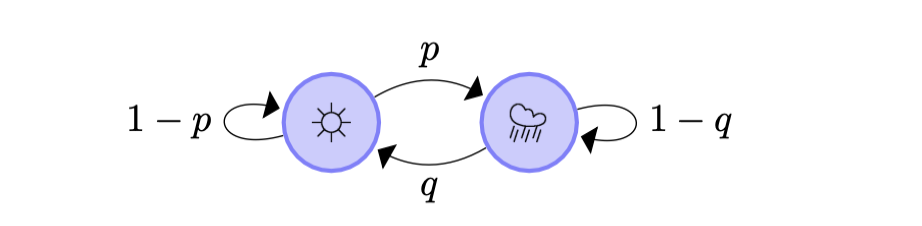

A Markov chain is a stochastic model representing a system that moves through a sequence of states, where the transition to the next state depends only on the current state, adhering to the Markov property.

My Bachelor Thesis focused on mixing times would examine the time it takes for a Markov chain to reach a state of relative equilibrium, where its probability distribution is close to its stationary distribution. This concept is crucial for understanding the efficiency of Markov chain algorithms and their practical applications, as lower mixing times indicate quicker convergence to a stable distribution and better performance in tasks like random sampling or optimization. It is written in German.