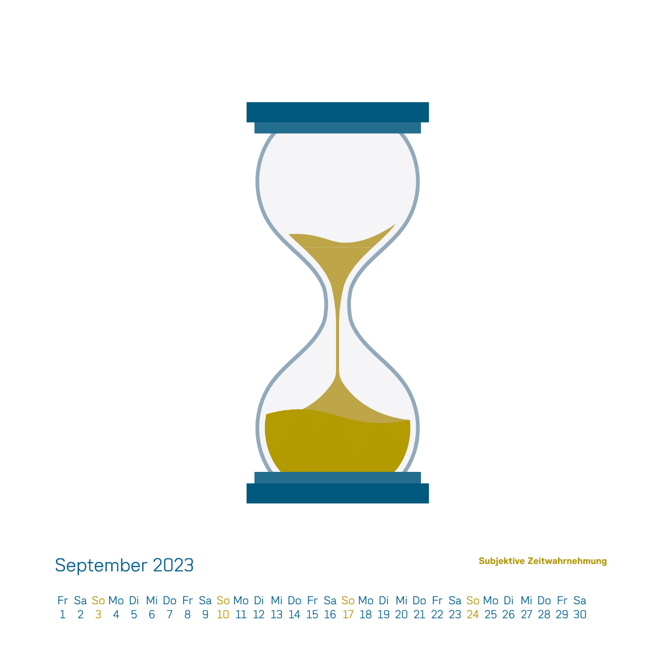

Back in 2016 I did an internship at an actuarial consultancy. For many years now, they hand out Maths related calendars to their customers. I was happy to contribute twice, for the 2023 and 2017 version. My calendar pages are linked below.
