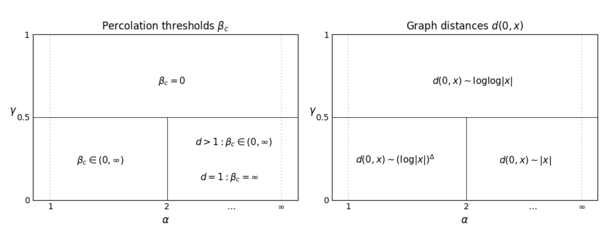

**Random connection models** are versatile mathematical objects employed across different fields, including the study of social networks. *My Master Thesis* aims to understand and describe a new parametrization of those models, specifically by examining their properties related to clustering and graph distances. 