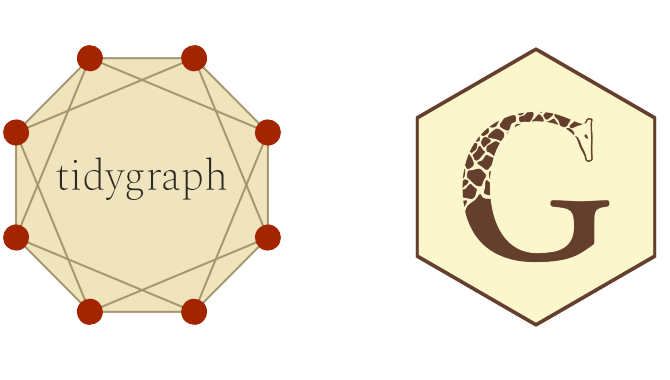
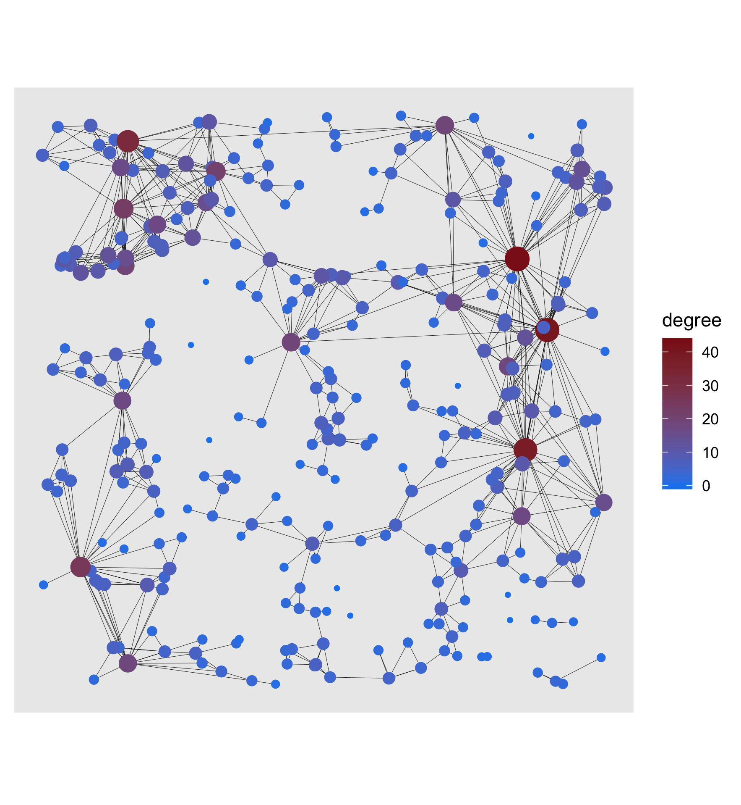
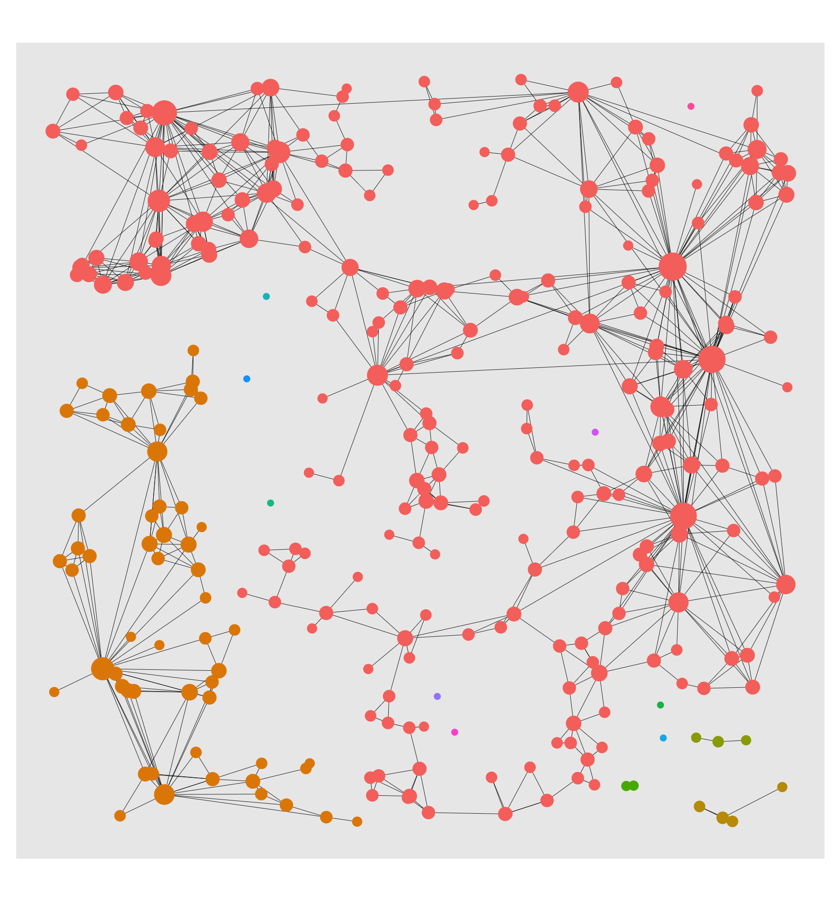
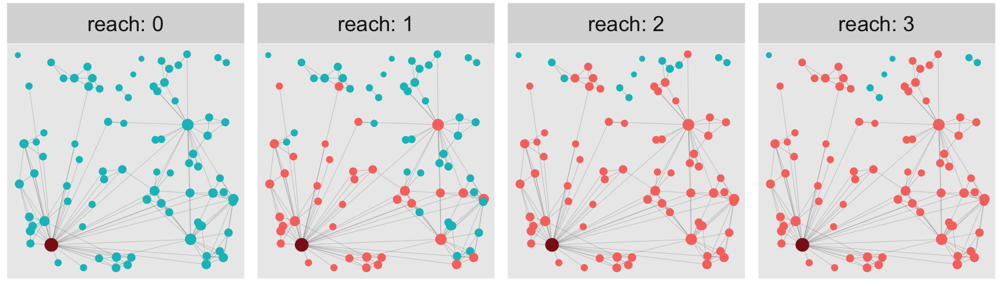
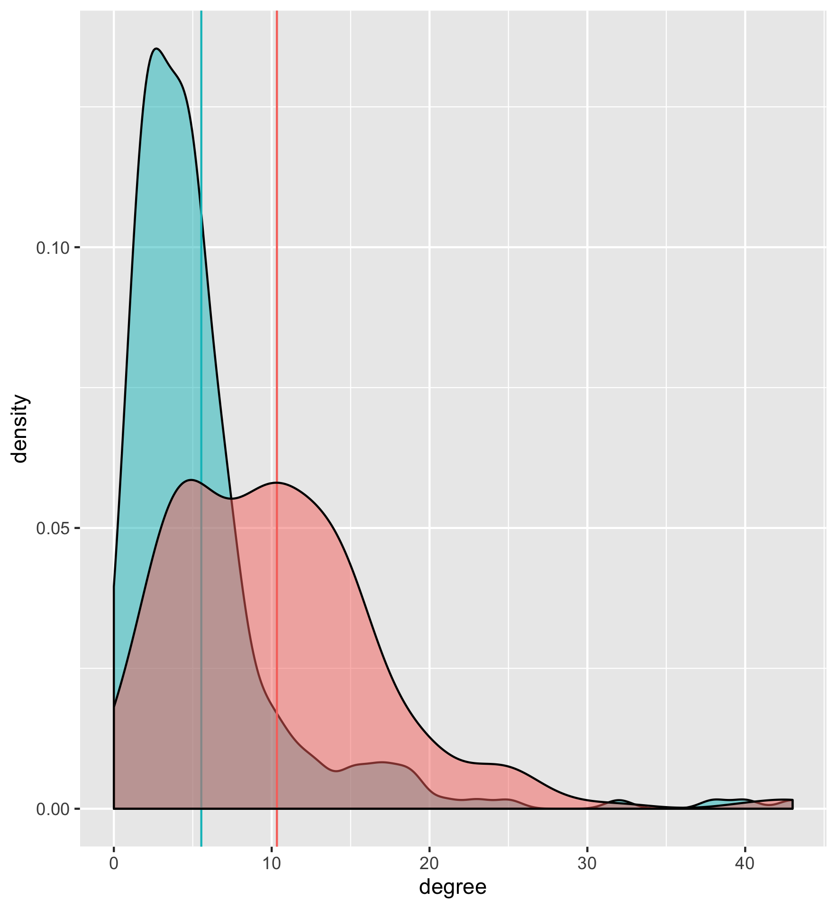

[latexpage]


 

"There is *no way* you know Thomas! What a coincidence! He's my best friend's saxophone teacher! This cannot be true. Here we are, at the other end of the world and *we* meet? What are the odds?" Surely, you have experienced similar situations, be it in a hotel's lobby, on the far away hiking trail or in the pub in that city you are completely new to. However, the very fact that this story is so suspiciously relatable might indicate that the chances of being socially connected to a stranger by a short chain of *friends of friends* aren't too low after all. 

Lots of research has been done in this field, one particular popular result being the **6-Handshake-Rule**. It states that most people living on this planet are connected by a chain of six handshakes or less. In the general setting of *graphs,* in which *edges connect nodes*, this is often referred to as the so-called *small-world-effect*. That is to say, the typical number of edges needed to get from *node A* to *node B* grows logarithmically in population size (i.e., # nodes). Note that, up until now, no geographic distance has been included in our consideration, which seems inadequate as it plays a significant role in social networks.

When analyzing data from social networks such as Facebook or Instagram, three observations are especially striking: 

* Individuals who are geographically farther away from each other are less likely to connect, i.e., people from the same city are more likely to connect.
* Few individuals have extremely many connections. Their number of connections follows a heavy-tailed Pareto distribution. Such individuals interact as *hubs* in the network. That could be a celebrity or just a *really* popular kid from school.
* Connected individuals tend to share a set of other individuals they are both connected to (e.g., "friend cliques"). This is called the *clustering property*.

## A model that *explains* these observations
    
Clearly, due to the characteristics of social networks mentioned above, only a model that includes geographic distances of the individuals makes sense. Also, to account for the occurrence of hubs, research has shown that reasonable models attach a random weight to each node (which can be regarded as the social attractiveness of the respective individual). A model that accounts for all three properties is the following: First, randomly place nodes in space with a certain intensity $\nu$, which can be done with a Poisson process. Then, with an independent uniformly distributed weight $U_x$ attached to each node $x$, every two nodes get connected by an edge with a probability

$$p_{xy} =\mathbb{P}(x\text{ is connected to } y):=\varphi(\frac{1}{\beta}U_x^\gamma U_y^\gamma \vert x-y\vert^d)$$

where $d$ is the dimension of the model (here: $d=2$ as we'll simulate the model on the plane), model parameter $\gamma\in [0,1]$ controls the impact of the weights, model parameter $\beta>0$ squishes the overall input to the profile function $\varphi$, which is a monotonously decreasing, normalized function that returns a value between $0$ and $1$. 

That is, of course, what we want because its output shall be a probability. Take a moment to go through the effects of different $\beta$ and $\gamma$ on $p_{xy}$. A higher $\beta$ yields a smaller input value for $\varphi$ and thereby a higher connection probability. Similarly, a high $\gamma$ entails a lower $U^\gamma$ (as $U\in [0,1]$) and thus a higher connection probability. All this comprises a scale-free random connection model, which can be seen as a [generalization](https://www.dropbox.com/s/9e2fiaab3cadu46/Master_Thesis_final.pdf?dl=0) of the [model](https://arxiv.org/pdf/1312.1948.pdf) by *Deprez* and *Würthrich*.  So much about the theory. Now that we have a model, we can use this to generate synthetic data that should look similar to real-world data. So let's simulate!

## Obtain data through simulation
From here on, the simulation is pretty straight forward. Don't worry about specific numbers at this point.
```{verbatimcode}
library(tidyverse)
library(fields)
library(ggraph)
library(tidygraph)
library(igraph)
library(Matrix)

# Create a vector with plane dimensions. The random nodes will be placed on the plane.
plane <- c(1000, 1000)

poisson_para <- .5 * 10^(-3) # Poisson intensity parameter
beta <- .5 * 10^3
gamma <- .4

# Number of nodes is Poisson(gamma)*AREA - distributed
n_nodes <- rpois(1, poisson_para * plane[1] * plane[2])
weights <- runif(n_nodes) # Uniformly distributed weights

# The Poisson process locally yields node positions that are completely random.
x = plane[1] * runif(n_nodes)
y = plane[2] * runif(n_nodes)

phi <- function(z) { # Connection function
  pmin(z^(-1.8), 1)
} 
```

What we need next is some information on which nodes are connected. That means, we need to first get the connection probability by evaluating $\varphi$ for each pair of nodes and then flipping a biased coin, accordingly. This yields a $0-1$ encoding, where $1$ means that the two respective nodes are connected and $0$ that they're not. We can gather all the information for all pairs in a matrix that is commonly known as the *adjacency matrix*. 
```{verbatimcode}
# Distance matrix needed as input
dist_matrix <-rdist(tibble(x,y))

weight_matrix <- outer(weights, weights, FUN="*") # Weight matrix

con_matrix_prob <- phi(1/beta * weight_matrix^gamma*dist_matrix^2)# Evaluation

con_matrix <- Matrix(rbernoulli(1,con_matrix_prob), sparse=TRUE) # Sampling
con_matrix <- con_matrix * upper.tri(con_matrix) # Transform to symmetric matrix
adjacency_matrix <- con_matrix + t(con_matrix)
```
## Visualization with ggraph
In an [earlier post]() we praised *visNetwork* as our go-to package for beautiful interactive graph visualization in R. While this remains true, we also have lots of love for tidyverse, and **ggraph** (spoken "g-giraffe") as an extension of ggplot2 proves to be a comfortable alternative for non-interactive graph plots, especially when you're already familiar with the *grammar of graphics*. In combination with **tidygraph**, which lets us describe a graph as two tidy data frames (one for the nodes and one for the edges), we obtain a full-fledged tidyverse experience. Note that tidygraph is based on a graph manipulation library called *igraph* from which it inherits all functionality and "exposes it in a tidy manner". So before we get cracking with the visualization in ggraph, let's first tidy up our data with tidygraph!



### Make graph data tidy again!
Let's attach some new columns to the node dataframe which will be useful for visualization. After we created the tidygraph object, this can be done in the usual dplyr fashion after using `activate(nodes)`and `activate(edges)`for accessing the respective dataframes. 
```{verbatimcode}
# Create Igraph object
graph <- graph_from_adjacency_matrix(adjacency_matrix, mode="undirected")

# Make a tidygraph object from it. Igraph methods can still be called on it.
tbl_graph <- as_tbl_graph(graph)

hub_id <- which.max(degree(graph))

# Add spacial positions, hub distance and degree information to the nodes.
tbl_graph <- tbl_graph %>%
  activate(nodes) %>%
  mutate(
    x = x,
    y = y,
    hub_dist = replace_na(bfs_dist(root = hub_id), Inf),
    degree = degree(graph),
    friends_of_friends = replace_na(local_ave_degree(), 0),
    cluster = as.factor(group_infomap())
  )
```
Tidygraph supports most of igraphs methods, either directly or in the form of wrappers. This also applies to most of the functions used above. For example breadth-first search is implemented as the `bfs_*` family, wrapping  `igraph::bfs()`, the `group_graph`family wraps igraphs clustering functions and `local_ave_degree()` wraps `igraph::knn()`.

### Let's visualize!
GGraph is essentially built around three components: Nodes, Edges and Layouts. Nodes that are connected by edges compose a graph which can be created as an igraph object. Visualizing the igraph object can be done in numerous ways: Remember that nodes usually are not endowed with any coordinates. Therefore, arranging them in space can be done pretty much arbitrarily. In fact, there's a specific research branch called *graph drawing* that deals with finding a good layout for a graph for a given purpose. 

Usually, the main criteria of a good *layout* are aesthetics (which is often interchangeable with clearness) and capturing specific graph properties. For example, a layout may force the nodes to form a circle, a star, two parallel lines, or a tree (if the graph's data allows for it). Other times you might want to have a layout with a minimal number of intersecting edges. Fortunately, in ggraph all the [layouts from igraph](https://igraph.org/r/doc/layout_.html) can be used. In this use case, we have calculated fixed coordinates for each node, meaning that we don't need to make use of any fancy layout algorithm.

We start with a basic plot by passing the data and the layout to `ggraph()`, similar to what you would do with `ggplot()` in ggplot2. We can then add layers to the plot. Nodes can be created by using `geom_node_point()`and edges by using `geom_edge_link()`. From then on, it's full-on ggplot2-style.
```{verbatimcode}
# Add coord_fixed() for fixed axis ratio!
basic <- tbl_graph %>%
  ggraph(layout = tibble(V(.)$x, V(.)$y)) +
  geom_edge_link(width = .1) +
  geom_node_point(aes(size = degree, color = degree)) +
  scale_color_gradient(low = "dodgerblue2", high = "firebrick4") +
  coord_fixed() +
  guides(size = FALSE)
```
{width=1000px} 

To see more clearly what nodes are essential to the network, the degree, which is the number of edges a node is connected with, was highlighted for each node. Another way of getting a good overview of the graph is to show a visual decomposition of the components. Nothing easier than that!
```{verbatimcode}
cluster <- tbl_graph %>%
  ggraph(layout = tibble(V(.)$x, V(.)$y)) +
  geom_edge_link(width = .1) +
  geom_node_point(aes(size = degree, color = cluster)) +
  coord_fixed() +
  theme(legend.position = "none")
```


Wouldn't it be interesting to visualize the reach of a hub node? Let's do it with a facet plot:
```{verbatimcode}
# Copy of tbl_graph with columns that indicate weather in n - reach of hub.
reach_graph <- function(n) {
  tbl_graph %>%
    activate(nodes) %>%
    mutate(
      reach = n,
      reachable = ifelse(hub_dist <= n, "reachable", "non_reachable"),
      reachable = ifelse(hub_dist == 0, "Hub", reachable)
    )
}
# Tidygraph allows to bind graphs. This means binding rows of the node and edge dataframes.
evolving_graph <- bind_graphs(reach_graph(0), reach_graph(1), reach_graph(2), reach_graph(3))

evol <- evolving_graph %>%
  ggraph(layout = tibble(V(.)$x, V(.)$y)) +
  geom_edge_link(width = .1, alpha = .2) +
  geom_node_point(aes(size = degree, color = reachable)) +
  scale_size(range = c(.5, 2)) +
  scale_color_manual(values = c("Hub" = "firebrick4",
                                "non_reachable" = "#00BFC4",
                                "reachable" = "#F8766D","")) +
  coord_fixed() +
  facet_nodes(~reach, ncol = 4, nrow = 1, labeller = label_both) +
  theme(legend.position = "none")
```


### A curious observation

 At this point, there are many graph properties (including the three above but also cluster sizes and graph distances) that are worth taking a closer look at, but this is beyond the scope of this blogpost. However, let's look at one last thing. Somebody just recently told me about a very curious fact about social networks that seems paradoxical at first: Your average friend on Facebook (or Instagram) has way more friends than the average user of that platform. 

It sounds odd, but if you think about it for a second, it is not too surprising. Sampling from the pool of *your* friends is very different from sampling from all users on the platform (entirely at random). It's exactly those very prominent people who have a much higher probability of being among your friends. Hence, when calculating the two averages, we receive very different results.



As can be seen, the model also reflects that property: In the small excerpt of the graph that we simulate, the average node has a degree of around 5 (blue intercept). The degree of connected nodes is over 10 on average (red intercept).

### Conclusion
In the first part, a model was introduced that describes the features of real-life data of social networks well. In the second part, we obtained artificial data from that model and used it to create an igraph object (by means of the adjacency matrix). The latter can then be  transformed to a tidygraph object, allowing us to easily make manipulation on the node and edge tibble to calculate any graph statistic (e.g. the degree) we like. Further, the tidygraph object is then used for conveniently visualizing the network through Ggraph.
I hope that this post has sparked your interest in network modeling and has given you an idea of how seamlessly graph manipulation and visualization with Tidygraph and Ggraph merge into the usual tidyverse workflow. . Have a wonderful day!